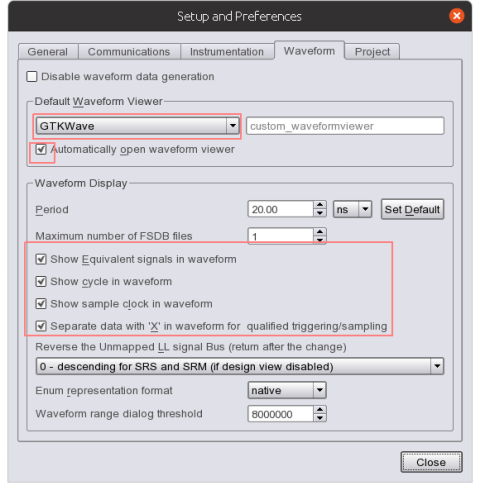

# 手順

## 前準備
1. ホストとターゲット基板をFlashPro5で接続する
2. ターゲット基板電源ON

## 手順
1. Synplify Pro起動 
    * Design Flow タブ “Implement Design” =>“Synthesize” をマウス右クリック => Open Interactively”を選択

2. Identify の設定
    * 初回のみ実施
    1. Synplify Pro の Project Files タブ “Synthesis” を選択して、Options” => “Configure Identify Launch…” を選択
        * "Integrated” を選択
        * Identify のインストール・フォルダ
        * “Use separate Identify license”を選択
    2. Project Files タブ “synthesis” をマウス右クリック、"New Identify Implementation…” を選択 
        * Add Identify Implementation
            * Implementation Name: synthesis_1
            * Results Directory: 格納フォルダ
            * Result Base Name: プロジェクト名
    3. Project Files タブ “synthesis_1” をマウス右クリック、“Identify Instrumentor” を選択
        * SRS Instrumentation
            * デフォルトのまま
        * WatchpointとBreakpointを設定
            * Watchpoint はデザイン内の信号の状態でトリガを生成
                * メガネをクリックして以下を選択
                    * Sample and Trigger
                    * Trigger Only
                    * Sample Only
                    * Sample Clock
            * Breakpoint はフローでトリガを生成
                * 行番号の横をクリックし、デバッグ用のBreakpoint を追加
        * Sample depth の設定
            * 測定時間の延長設定
                * “Control Panel”タブを選択し、FPGA Memory” をクリック
                    * “Edit IICE Settings” の “IICE Sampler” タブ
                    * Sample depth: ボタンで増減し設定
        * 終了
            * “File”=>“Save All”を選択

3. IICE(Intelligent In Circuit Emulator)を組み込んだ論理合成
    * "synthesis_1” をマウス左クリックし選択 "RUN"を選択

4. IICE を組み込んだ配置配線
    *  Design Flow タブ “Implement Design” =>“Place and Route” をダブルクリック

5. IICE を組み込んだデバイス書き込み
    1. Select Programerにて、JTAG USBポート設定
    2. Design Flow タブ “Program and Debug Design”=> “Run PROGRAM Action” をダブルクリック

6. Identify デバッカ起動
    1. Design Flow タブ “Program and Debug Design”=> “Debug Design” => “Identify Debug Design” をダブルクリック
    2. トリガ条件設定
        *“Browser” の “File” よりマウス左クリックで HDL を選択
        * ターゲット信号を右クリックし “Triggering"から選択
        * アイコンを使用し、サンプル・バッファ内のトリガ・ポイントを変更
    3. 実行 
        1. RUNを選択（オシロの Single Trigger に相当）
            * トリガー条件を満たせは "Run" ボタンが "Stop" になり停止
    4. 波形表示
        1. Debugger” メニュー => "Waveform viewer" で波形表示
        2. Waveform viewer セッティング
                
            

