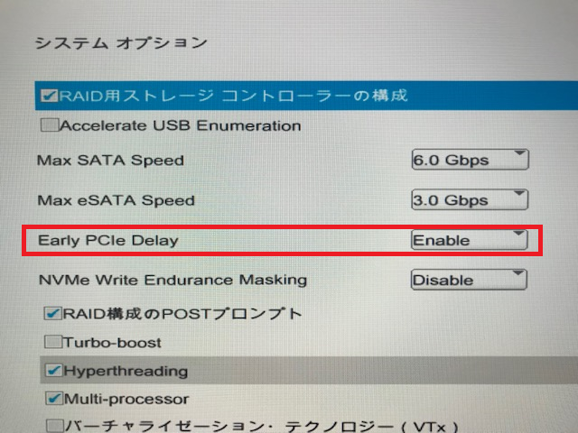

# HP Z240の怪
 
## PolarFire FPGA Evaluation Kit
* HP Z240では、PolarFire FPGA Evaluation Kitをまったく認識しなかった
* 原因は

* Early PCIe DlayをEnableにしてください。
* BIOS => Advance => システムオプション => Early PCIe Delay => Enable

