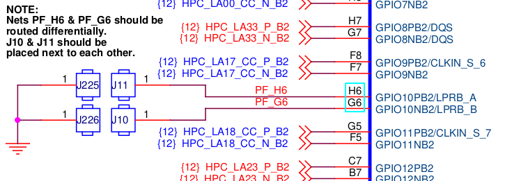
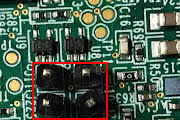
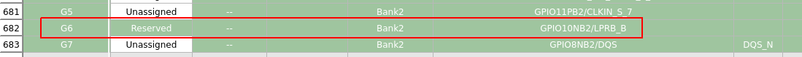
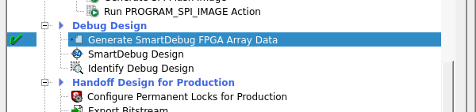
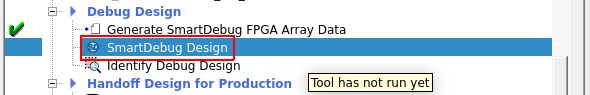
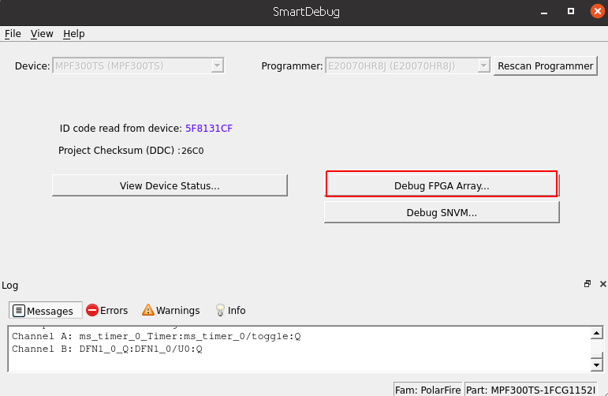
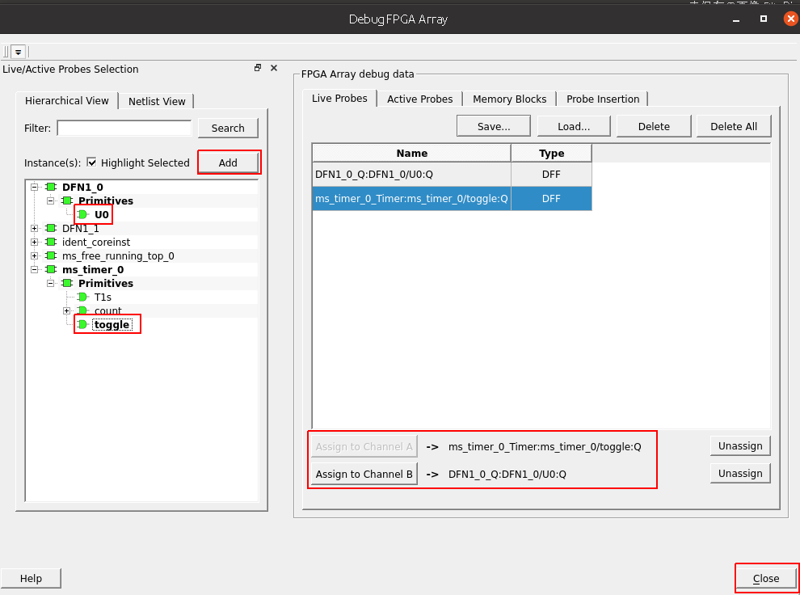
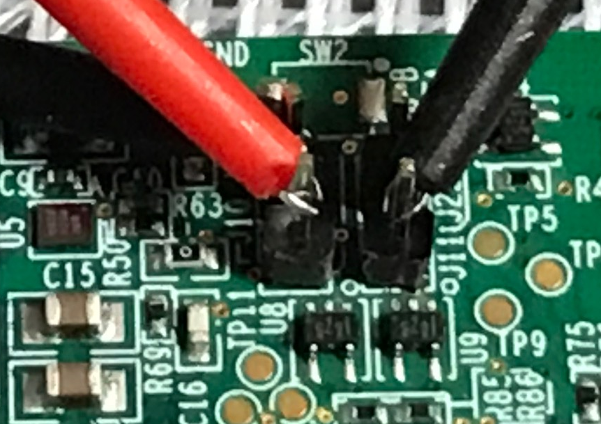
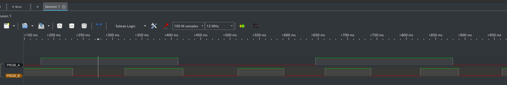

# 手順

## MPF300評価ボード 観測ポイント
*  回路図
    

* MPF300評価ボードの場合、H6/G6は予約されている。
    

* MPF300評価ボードの場合、H6/G6は予約されている。
    

## 前準備
1. ホストとターゲット基板をFlashPro5で接続する
2. ターゲット基板電源ON

## 手順
1. SmartDebug( スマート・デバッグ ) の起動 
    1. Generate SmartDebug FPGA Arrayを行う
        

    2. SmartDebug Designを起動する
        

    3. Debug FPGA Arrayを選択
        

    4. 観察データを設定する。
        1. 信号選択
        2. Addを押す。
        3. Probe A or Bを割り当てる
        

2. 信号を観察する
    1. テストピンにプローブを配置する。
        

    2. 信号を観察する
        
        * 500msタイマ信号
        * プッシュボタン信号

