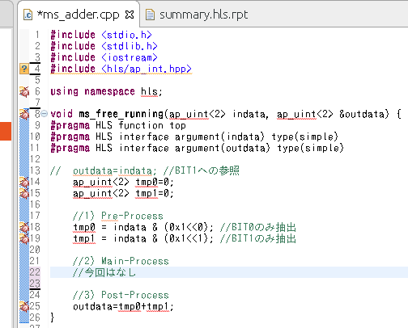
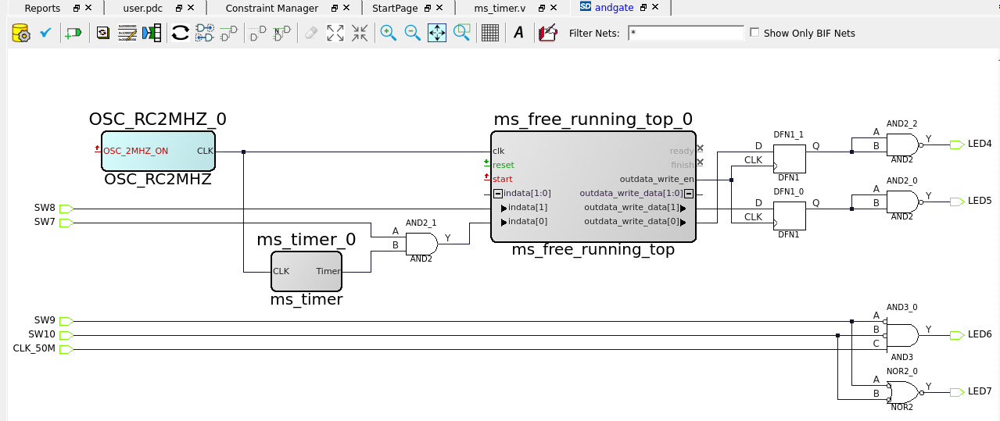
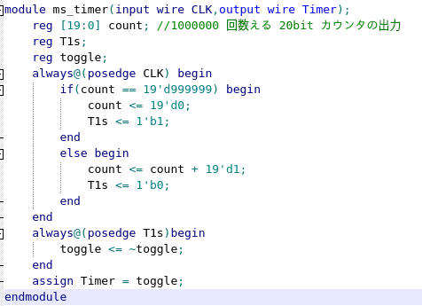

# ポートレベルのインターフェースプロトコルの信号 IP作成
SmartHLSを用いて、ハンドシェークの信号無しのIPを作成し、LiberoにてLED点灯させます。

## 開発環境
* Libero SoC v2022.1
* SmartHLS
* MPF300-EVAL-KIT-ES

## 手順
1. IP作成
    1. SmartHLS起動 
        
        

    2. コンパイル実行(SW to HW) 
        * error.h見つからないコンパイルエラーが発生したらこれをやる
        * ln -s /usr/include/asm-generic /usr/include/asm

2. LiberoIdentify の設定
    1. Libero起動
    2. Project => Excute Script => Smart HLSの作業ディレクトリにある"create_hdl_plus.tcl" を選択 
    3. 右クリック => instatiate in ***を選択し、D上にインスタンスを生成する。
    4. 配線する
        
        
        * タイマHDL
        
        .png

    5. 論理合成を行う。
        1. 右クリックし、intactivelyを選択し、Synplify Proを起動する。
        2. 観察条件を設定する。
        3. "Run"を押して、合成する。
        4. 保存を押す
        5. 終了する。
    6. IO制約を設定する。
        1. Edit I/Oを選択し、ポート仕様を定義する。
    7. Place and Routeを行う
    8. Idenfity Debug Designを行い、ロジックアナライザを起動し、信号を観察する。

